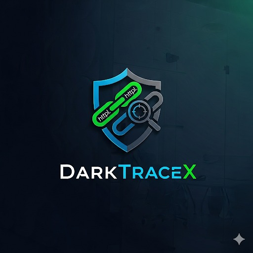
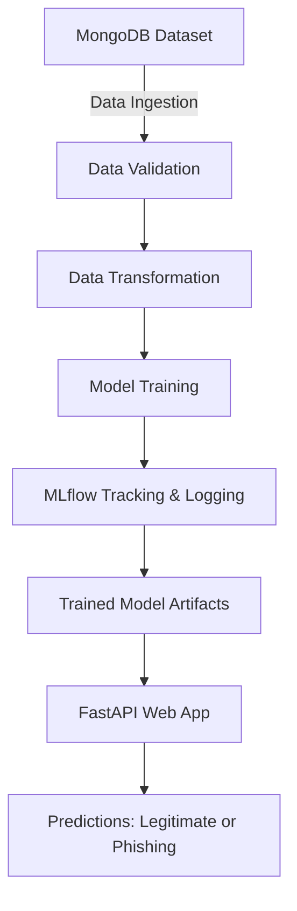
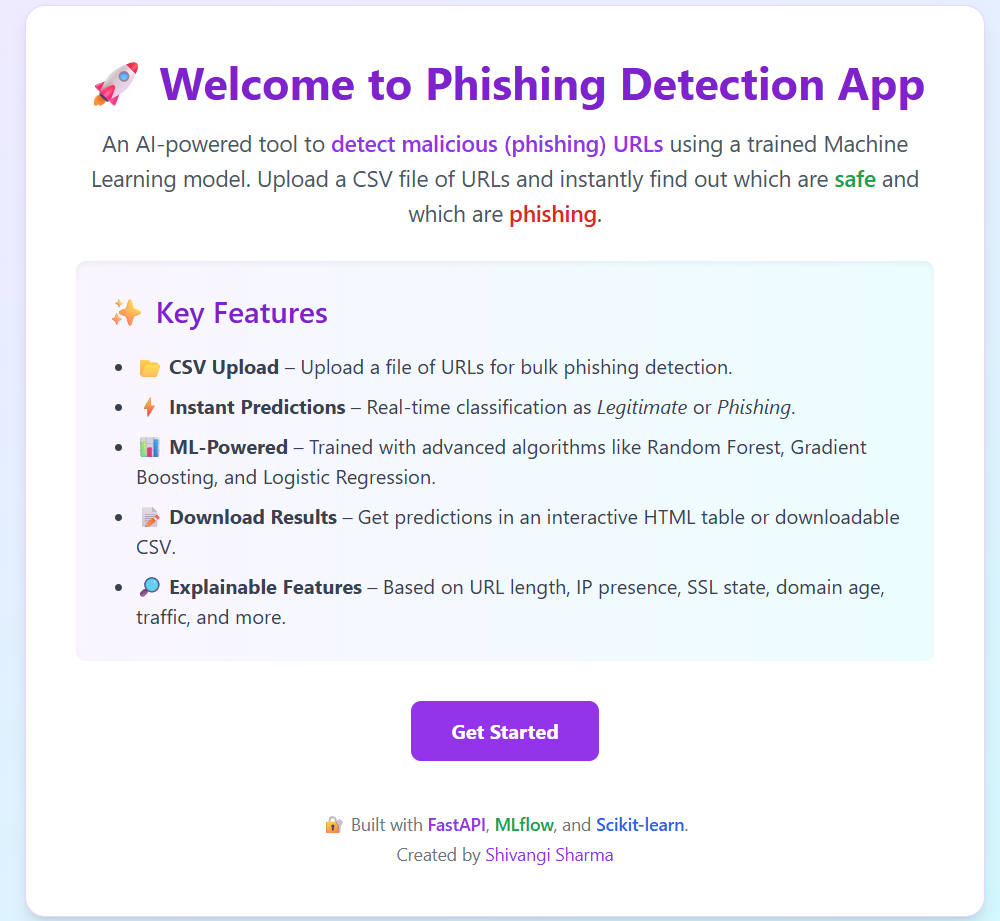
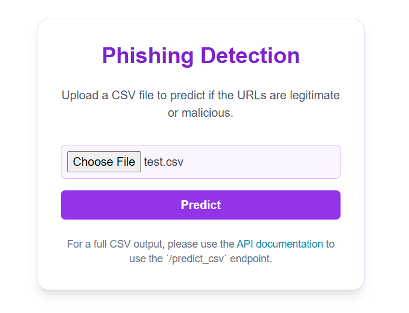
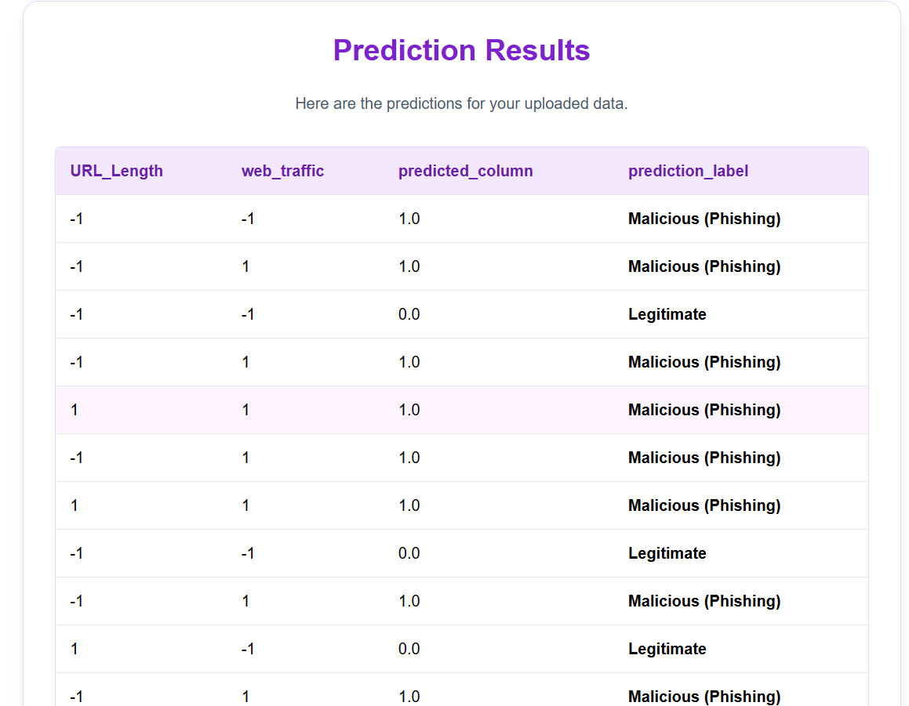

<p align="center">
  
</p>

# DarkTraceX: Phishing URL Detection


An **end-to-end Machine Learning project** for detecting phishing URLs using classification models.
This project includes a **modular ML pipeline**, **MLflow integration**, and a **FastAPI-powered dashboard** for real-time inference.

---

## 🚀 Features

* ⚡ **FastAPI Web Application**

  * Upload CSV files of URLs and get instant predictions.
  * Download results as HTML tables or CSV.

* 🧑‍💻 **Automated Training Pipeline**

  * Data ingestion from MongoDB.
  * Data validation against schema.
  * Feature engineering and transformation.
  * Model training with multiple algorithms (Random Forest, Decision Tree, Logistic Regression, etc.).

* 📊 **MLflow + DagsHub Tracking**

  * Logs model metrics (precision, recall, F1-score).
  * Experiment comparison.
  * Model registry support.

* 🛡️ **Cybersecurity Focus**

  * Detect malicious URLs before they cause harm.
  * Feature-driven detection based on web characteristics.

---

## 🏗️ Project Architecture



---

## 📂 Repository Structure

```bash
Network_Security/
│── app.py                  # FastAPI application
│── main.py                 # Training pipeline trigger
│── requirements.txt        # Dependencies
│── .env                    # MongoDB connection (not shared)
│── networksecurity/        # Core ML pipeline
│   ├── entity/             # Config & artifact entities
│   ├── utils/              # Utility functions
│   ├── logging/            # Logging module
│   ├── exception/          # Custom exceptions
│   └── ...                 
│── data_schema/schema.yaml # Schema for dataset
│── Artifacts/              # Training artifacts
│── final_model/            # Saved trained models
```

---

## 🧑‍🔬 Data Schema

The model uses **URL-based features** (from `data_schema/schema.yaml`) such as:

* `having_IP_Address`, `URL_Length`, `Shortining_Service`
* `SSLfinal_State`, `Domain_registeration_length`, `age_of_domain`
* `web_traffic`, `Page_Rank`, `Google_Index`
* and more…

Target column: **`Result`** → `1` (Phishing) / `-1` (Legitimate)

---

## ⚙️ Getting Started

### 🔑 Prerequisites

* Python 3.10+
* MongoDB instance running
* `.env` file with:

```env
MONGODB_URL_KEY=your_mongodb_connection_string
```

### 📥 Installation

```bash
git clone https://github.com/Shiv24angi/Network_Security.git
cd Network_Security
pip install -r requirements.txt
```

---

### ▶️ Running the Web App

```bash
uvicorn app:app --reload
```

Now visit: [http://localhost:8000](http://localhost:8000)

---

### 🏋️ Training the Model

```bash
python main.py
```

* Creates new artifacts under `Artifacts/`.
* Trained model saved in `final_model/model.pkl`.
* Training metrics automatically logged to **MLflow + DagsHub**.

---

## 📊 Example Dashboard






---

## 🤝 Contribution

Contributions are welcome! 🎉

1. Fork the repo 🍴
2. Create a new branch (`feature-xyz`)
3. Commit your changes (`git commit -m "Added xyz feature"`)
4. Push to the branch (`git push origin feature-xyz`)
5. Open a Pull Request 🚀

---

## 📌 Future Improvements

* ✅ Add deep learning models for better accuracy
* ✅ Integrate live URL scanning API
* ✅ Deploy app with Docker + Cloud hosting

---

## 🧑‍💻 Author

**Shivangi Sharma**
📧 [LinkedIn](https://www.linkedin.com/in/shivangi-sharma2405/) | 🌐 [GitHub](https://github.com/Shiv24angi)


